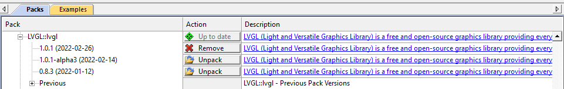
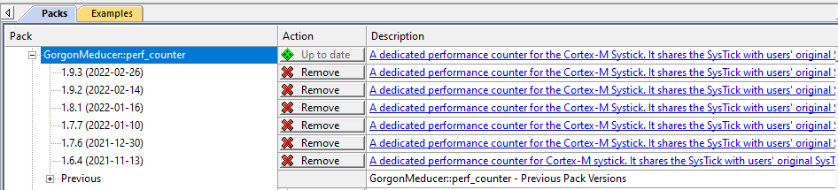
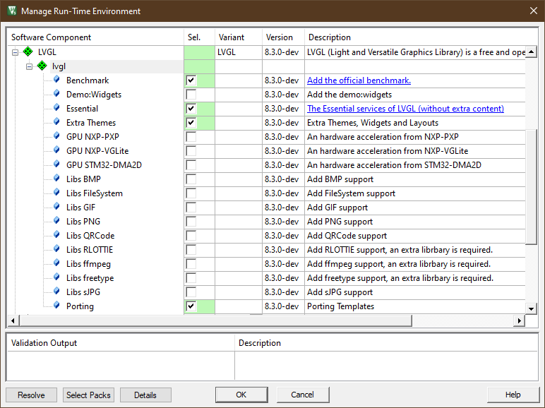
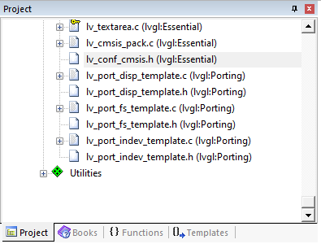

# lv_port_raspberry_pi_pico_mdk

An MDK template for Raspberry Pi Pico + LVGL:

- **"Comfortable Zone" for MCU developers**
  - **[MDK Community License](https://www.keil.com/pr/article/1299.htm)**: Arm has released a community license for open source community. It is free for non-commercial uses. **No limitations on code size or debug**.  
  - **The Latest Arm Compiler 6**: Using the state of art compiler, i.e. the Arm Compiler 6 for Raspberry Pi Pico instead of using the "just-so-so" arm-gcc. 
  - **Debug in MDK without Extra-Pico**: [Using CMSIS-DAP](https://github.com/majbthrd/pico-debug) (Validated in MDK and **highly recommended**)
- **Support the latest pico-sdk (v1.4.0)**
- **Support the latest LVGL**: Using CMSIS-Pack for deployment.


## How to Use

### 1. Get the project template

I assume that you have the MDK installed on your PC. You can obtained [a free community license here](https://www.keil.com/pr/article/1299.htm). Please clone the project template with following command line:

```
mkdir pico-mdk
cd pico-mdk

git clone https://github.com/lvgl/lv_port_raspberry_pi_pico_mdk.git .

git submodule update --init
```


### 2. Install cmsis-pack(s)

#### 2.1 LVGL cmsis-pack

For ease of use, we deploy the LVGL to the project template using the the LVGL cmsis-pack. If you haven't installed it, you can always find the latest version from [here](https://github.com/lvgl/lvgl/tree/master/env_support/cmsis-pack). Once you download it, please double click to install. Just following the step by step guidance, piece of cake. 


#### 2.2 perf_counter cmsis-pack

This project template uses a module called `perf_counter` to facilitate the LVGL porting. It is also deployed with a cmsis-pack. If you haven't install it, please find it from the `cmsis-pack` folder. 

The key is that as long as the `lv_conf_cmsis.h` detects the perf_counter module, it set `LV_TICK_CUSTOM` to `1` and use the API `get_system_ms()` from `perf_counter` to implement `lv_tick_get()`, in other words, users do NOT have to deal with `lv_tick_inc()` as suggested by the [LVGL porting document](https://docs.lvgl.io/master/porting/tick.html). 


```c
/*Use a custom tick source that tells the elapsed time in milliseconds.
 *It removes the need to manually update the tick with `lv_tick_inc()`)*/
#ifdef __PERF_COUNTER__
    #define LV_TICK_CUSTOM 1
    #if LV_TICK_CUSTOM
        extern uint32_t SystemCoreClock;
        #define LV_TICK_CUSTOM_INCLUDE              "perf_counter.h" 
        
        #if __PER_COUNTER_VER__ < 10902ul
            #define LV_TICK_CUSTOM_SYS_TIME_EXPR    ((uint32_t)get_system_ticks() / (SystemCoreClock / 1000ul))
        #else
            #define LV_TICK_CUSTOM_SYS_TIME_EXPR    get_system_ms()
        #endif
    #endif   /*LV_TICK_CUSTOM*/
#else
    #define LV_TICK_CUSTOM 0
    #if LV_TICK_CUSTOM
        #define LV_TICK_CUSTOM_INCLUDE "Arduino.h"         /*Header for the system time function*/
        #define LV_TICK_CUSTOM_SYS_TIME_EXPR (millis())    /*Expression evaluating to current system time in ms*/
    #endif   /*LV_TICK_CUSTOM*/
#endif       /*__PERF_COUNTER__*/
```


#### 2.3 Updating installed cmsis-packs in the future

The aforementioned cmsis-packs are updated regularly, for example, the LVGL cmsis-pack is updated in monthly manner. Once installed, you don't have to check the LVGL repo and download the latest cmsis-pack manually. Instead, you can open the `pack-installer` from MDK, select menu `Packs->Check for Updates` and see whether there are any updates on those cmsis-packs. 


###### The LVGL cmsis-pack in Pack-installer




###### The perf_counter cmsis-pack in Pack installer




### 3. About the project templates

This LVGL porting project is derived from a open-source project call [Pico-Template](https://github.com/GorgonMeducer/Pico_Template). For any questions about the project template, such as:

- How to Debug
- How to set stack size and heap size
- How to choose different project configurations for different scenarios.
- How to use Printf
- How to retarget stdout and stdin 
- etc.

Please refer to the original [Pico-Template](https://github.com/GorgonMeducer/Pico_Template) for help. Or you can find a [readme](./project/mdk/README.md) in the `project/mdk` folder. 


### 4. About the LVGL 

#### 4.1 LVGL components management

Since the LVGL is deployed using the cmsis-pack, it is managed in the **RTE (Run-Time-Environment)** window, as shown below. You can open this window from the menu: `Project->Manage->Run-Time-Environment`.


###### LVGL in RTE window

 


Usually, we only select the components required for our application to save space, as shown in the picture above, the component `Essential` is ***mandatory*** and the components `Extra Themes` and `Porting` are selected for most of the applications. 

#### 4.2 LVGL configuration

LVGL is configured via a file called `lv_conf_cmsis.h` which is derived from the `lv_conf_template.h`. You can find this header file in MDK project viewer.


###### The lv_conf_cmsis.h in the Project View

 


#### 4.3 Porting

Once we select the porting component in the RTE, templates files will be added to the project. In this project, I have already implemented a porting for a popular [LCD 1.3inc module](https://www.waveshare.com/wiki/Pico-LCD-1.3). 

**NOTE**: Since there is no touch-pad on this LCD extension board, we use the joystick and key `Y` to mimic a mouse.  


###### A popular 240x240 LCD extension board for Raspberry Pi Pico

 

#### 4.5 Benchmark and Demos

The LVGL cmsis-pack provides two demos, the `benchmark` and `Widgets`. Selecting one of them in the RTE configuration will insert the necessary code in `main.c`:


```c
int main(void)
{
    system_init();
    
    printf("Hello Pico-Template\r\n");
    
    lv_init();
    lv_port_disp_init();
    lv_port_indev_init();

/* We have no sufficient SRAM to run those demos in all-in-ram mode*/
#if !defined(PICO_NO_FLASH)
#   if LV_USE_DEMO_BENCHMARK
    lv_demo_benchmark();
#   endif
    
#   if LV_USE_DEMO_WIDGETS
    lv_demo_widgets();
#   endif
#endif
    
    while(1) {
        lv_timer_handler_run_in_period(5);
    }
    
}
```


As you can see here: the functions `lv_demo_benchmark()` and `lv_demo_widgets()` are protected by a macro switch `PICO_NO_FLASH` which is defined in the project configurations [**AC6-DebugInSRAM**] and [**AC6-DebugInSRAM-printf**]. Those two project configurations store all the code in SRAM. We only have less than **248KB** SRAM for both code and data, and the code size of those two demos are too big to be fitted into SRAM. As a consequence, we can only run those demos on the following project configurations:

- [**AC6-flash**]  Stores and runs code in the 2MByte external flash
- [**AC6-RunInSRAM**] Stores **RO-CODE** and **RO-DATA** in the external flash, and runs code in SRAM (RO-DATA is still in the external flash)


## License

- LVGL used in this project is under MIT license.
- This project template is under Apache 2.0 license.
- perf_counter used in this project is under Apache 2.0 license.


Enjoy~